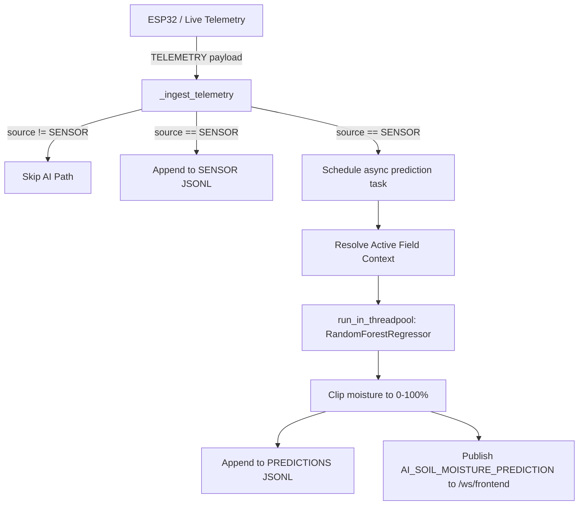

# AI / Soil Moisture Prediction Module

This backend-only module predicts volumetric soil moisture percentage (`soil_moisture_pct`) at unsampled grid locations across a field. It uses a pre-trained scikit-learn `RandomForestRegressor` pipeline.

> [!IMPORTANT]
> **Strict Operational Boundaries**: AI strictly estimates volumetric water content at unsampled coordinates between physical probe readings. AI never influences navigation, motor control, safety routines (E-stop, geofencing), obstacle avoidance, or user agronomic prescriptions (fertilizer, seeding). A physical `SENSOR` reading is always retained as immutable ground truth and is never overwritten by a prediction.

---

## Architecture & Data Flow



### Key Design Invariants
1. **Source Discrimination**:
   - `"SENSOR"`: Physical hardware probe measurement (immutable ground truth).
   - `"ML_MODEL"`: Machine learning spatial estimate.
   - `"SIMULATION"`: Synthetic simulator output.
2. **Infinite-Loop Guard**: Only telemetry with `"source": "SENSOR"` can trigger model evaluation. Records tagged `"ML_MODEL"` or `"SIMULATION"` are ignored by `_ingest_telemetry`, preventing runaway prediction loops.
3. **Async Event-Loop Offloading**: Inference calls `run_in_threadpool(app.state.ml_model.predict, ...)`, ensuring CPU-bound scikit-learn execution never blocks FastAPI's asynchronous WebSocket or REST event loop.
4. **Field Context Hierarchy**:
   1. Active mission (`app.state.active_mission["field_id"]`)
   2. Active configured field (`app.state.active_field_id`)
   3. If neither exists, prediction is safely skipped without raising unhandled errors.

---

## Feature Contract & Ground Truth

The trained pipeline accepts strictly **6 features**:

| Feature | Type | Constraints / Supported Values | Description |
|---|---|---|---|
| `x_m` | `float` | Finite | Local Cartesian East coordinate (meters) |
| `y_m` | `float` | Finite | Local Cartesian North coordinate (meters) |
| `soil_type` | `str` | `"loam"`, `"sandy"`, `"clay"`, `"silt"`, `"red_soil"` | One-hot encoded; defaults safely to `"loam"` if unknown |
| `humidity_pct` | `float` | $[0.0, 100.0]$ | Ambient relative humidity percentage |
| `depth_mm` | `float` | $> 0.0$ | Sensor insertion depth in millimeters |
| `hours_since_irrigation` | `float` | $\ge 0.0$ | Elapsed hours since last recorded watering |

*Note on earlier draft specifications: Earlier drafts proposed a 4-feature vector `[x_m, y_m, soil_moisture_pct, soil_temp_c]`. The active ground-truth model is the 6-feature pipeline above; no temperature feature is utilized.*

---

## Retraining & Dataset Generation

All synthetic data and models are fully reproducible using fixed seed `42`:

```bash
# Generate synthetic dataset (2,000 balanced rows)
python -m ai.training.generate_synthetic_data

# Train and serialize the Random Forest model
python -m ai.training.train_model
```

- Dataset path: `backend/data/synthetic/soil_moisture_dataset.csv`
- Model artifact: `backend/ai/model/soil_moisture_model.joblib`
- Training metrics: `backend/ai/model/training_metrics.json`
- Model version identifier: `rf_v1` (defined in `backend/ai/constants.py`)
- Custom model path: Can be overridden at runtime via the `SOIL_MOISTURE_MODEL_PATH` environment variable.

---

## API & Schema Reference

### 1. Manual Prediction Endpoint
`POST /ai/predict-soil-moisture`

**Request Body**:
```json
{
  "x_m": 4.5,
  "y_m": 12.0,
  "soil_type": "loam",
  "humidity_pct": 68.2,
  "depth_mm": 150.0,
  "hours_since_irrigation": 3.5
}
```

**Response (`200 OK`)**:
```json
{
  "timestamp": "2026-09-08T22:45:18.085138Z",
  "field_id": "field_alpha",
  "x_m": 4.5,
  "y_m": 12.0,
  "depth_mm": 150.0,
  "soil_type": "loam",
  "humidity_pct": 68.2,
  "hours_since_irrigation": 3.5,
  "predicted_moisture_pct": 65.05,
  "source": "ML_MODEL",
  "model_name": "RandomForestRegressor",
  "model_version": "rf_v1"
}
```

**Graceful Degradation (`503 Service Unavailable`)**:
If the model file is absent or incompatible, the service boots normally with `ai_status: "AI_UNAVAILABLE"`. Core rover endpoints remain operational, while this endpoint returns:
```json
{
  "detail": {
    "status": "AI_UNAVAILABLE",
    "message": "Soil-moisture model is unavailable"
  }
}
```

### 2. Storage Paths
- Raw Sensor Records: `backend/data/ai/soil_moisture_sensor_readings.jsonl`
- AI Prediction Records: `backend/data/ai/soil_moisture_predictions.jsonl`
- Field Configuration: `backend/data/ai/field_configurations.json`

---

## Testing & Validation Metrics
- **Synthetic Validation (seed 42)**: MAE 3.040, RMSE 3.787, $R^2$ 0.935 (reported for synthetic validation only; no real-field accuracy claims are made).
- **Automated Tests**: Run `python -m pytest tests/test_ai.py -v` (7 tests covering recursion guard, context resolution precedence, unknown soil type fallback, threadpool offload, and 503 fallback).

